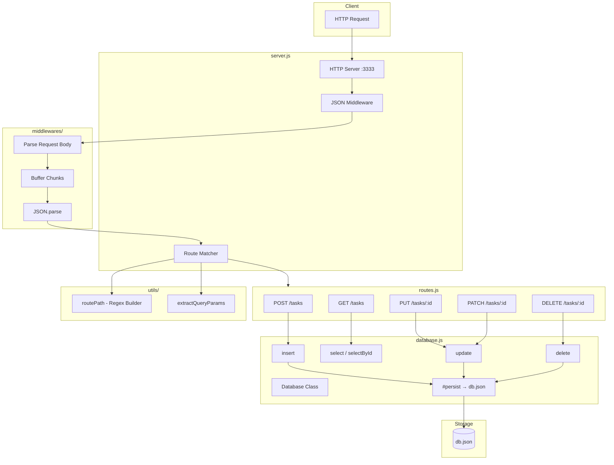
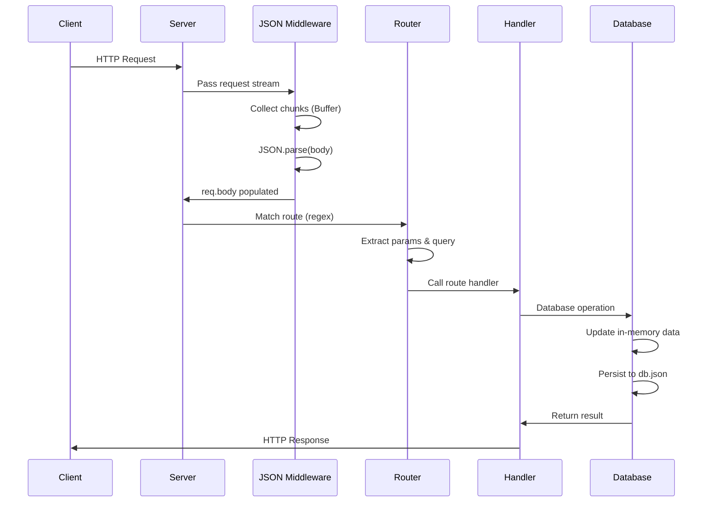

# 📋 Tasks CRUD - Node.js Fundamentals

A REST API project for task management, built with **pure Node.js**, without any frameworks. The goal is to explore Node.js fundamentals "under the hood", implementing concepts like streams, buffers, and the native HTTP module.

> 🎓 Practical project from [Rocketseat](https://app.rocketseat.com.br/projects/ignite-node-js-2023-modulo-01?module_slug=desafio-pratico-crud-tarefas&origin=/jornada/node-js-2023/conteudos) Node.js course

## 🎯 Objective

Implement CRUD operations (Create, Read, Update, Delete) using only Node.js native modules, understanding:

- How the HTTP server works under the hood
- Stream and buffer manipulation for reading request body
- Manual routing with regex for dynamic parameters
- Data persistence in JSON file
- Query parameters parsing

## 🏗️ Architecture



## 🔄 Request Flow



## 🚀 Features

| Method | Route | Description |
|--------|-------|-------------|
| `POST` | `/tasks` | Create new task |
| `GET` | `/tasks` | List tasks (with optional filters) |
| `PUT` | `/tasks/:id` | Update title and description |
| `DELETE` | `/tasks/:id` | Remove task |
| `PATCH` | `/tasks/:id` | Mark task as completed |

### Query Parameters (GET /tasks)

- `?title=text` - Filter by title
- `?description=text` - Filter by description

## 📦 Project Structure

```
crud_tarefas/
├── db.json                      # JSON database
├── package.json
├── src/
│   ├── server.js                # HTTP Server
│   ├── routes.js                # Route definitions
│   ├── database.js              # Database class with persistence
│   ├── middlewares/
│   │   └── json.js              # Body parsing middleware
│   ├── utils/
│   │   ├── route-path.js        # Regex generator for routes
│   │   └── extract-query-params.js
│   └── csv-files/
│       ├── import-csv.js        # CSV import script
│       └── tasks.csv            # Seed file
```

## 🛠️ Applied Concepts

### Streams & Buffers
The JSON middleware reads the request body as a stream, accumulating chunks in a buffer before parsing:

```javascript
for await (const chunk of req) {
  buffers.push(chunk)
}
req.body = JSON.parse(Buffer.concat(buffers).toString())
```

### Regex Routing
Dynamic routes are converted into regular expressions with named capture groups:

```javascript
// /tasks/:id → /^\/tasks\/(?<id>[a-z0-9\-_]+)(?<query>\?(.*))?$/
```

### JSON Persistence
Data is kept in memory and synchronized with a JSON file:

```javascript
#persist() {
  fs.writeFile(databasePath, JSON.stringify(this.#database))
}
```

## 🚀 How to Run

### Prerequisites
- Node.js 18+

### Installation

```bash
# Clone the repository
git clone <repo-url>
cd crud_tarefas

# Install dependencies
pnpm install
```

### Run the server

```bash
# Development mode (with watch)
pnpm dev

# Or directly
node src/server.js
```

The server will be available at `http://localhost:3333`

### Import tasks via CSV

```bash
# With the server running in another terminal
node src/csv-files/import-csv.js
```

## 📝 Request Examples

### Create task
```bash
curl -X POST http://localhost:3333/tasks \
  -H "Content-Type: application/json" \
  -d '{"title": "Study Node", "description": "Streams module"}'
```

### List tasks
```bash
curl http://localhost:3333/tasks
```

### Filter tasks
```bash
curl "http://localhost:3333/tasks?title=node"
```

### Update task
```bash
curl -X PUT http://localhost:3333/tasks/<id> \
  -H "Content-Type: application/json" \
  -d '{"title": "New title", "description": "New description"}'
```

### Complete task
```bash
curl -X PATCH http://localhost:3333/tasks/<id>
```

### Delete task
```bash
curl -X DELETE http://localhost:3333/tasks/<id>
```


---

Developed during Rocketseat Node.js course
